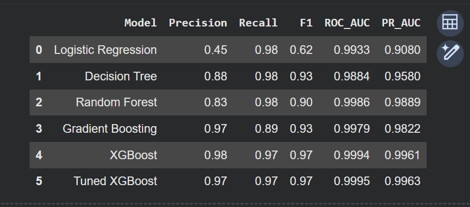
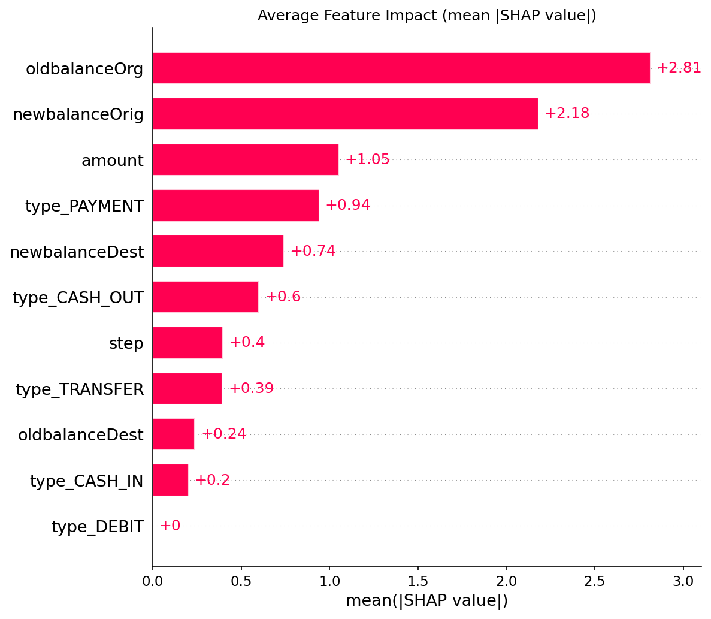
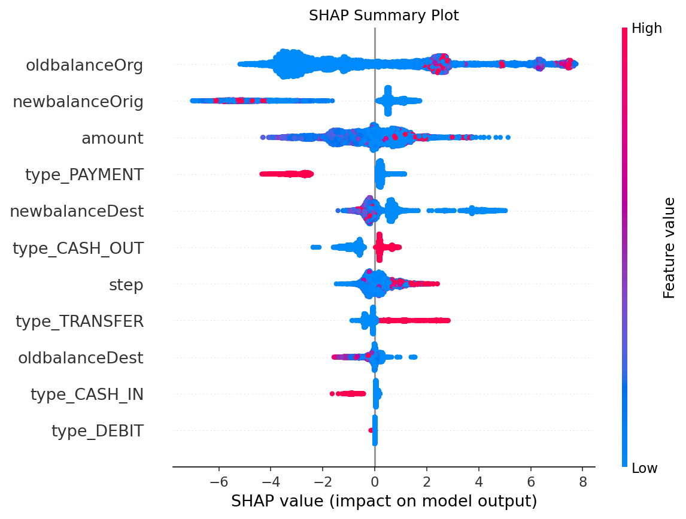
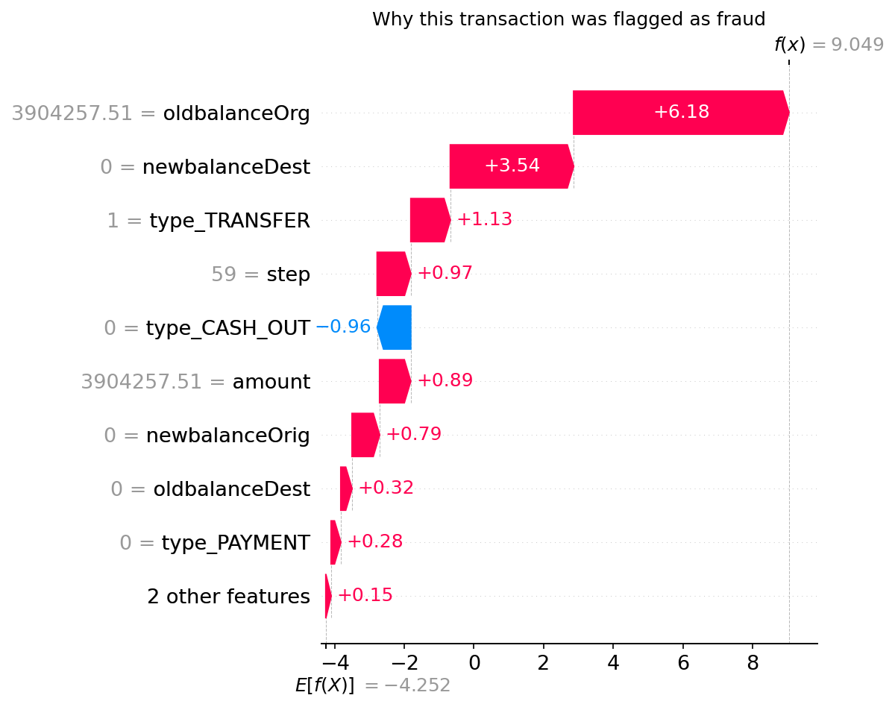

# Fraud Detection using Machine Learning

This project builds a machine learning model to detect fraudulent financial transactions. The main challenge is that fraud is very rare (about 0.13% of all transactions), so a model that predicts "not fraud" for everything would still be 99.87% accurate. Because of this, the project focuses on recall, precision and PR-AUC instead of accuracy.

The final model is an XGBoost classifier tuned with Optuna. It catches **95.7% of fraud** on a test set.

## Dataset

The project uses the [Fraud Detection Dataset](https://www.kaggle.com/datasets/amanalisiddiqui/fraud-detection-dataset) from Kaggle, which has about 6.36 million transactions.

| Class | Transactions |
|---|---:|
| Normal | 6,354,407 |
| Fraud | 8,213 |
| Fraud rate | ~0.129% |

The CSV is around 470 MB, so it is read in chunks with pandas. It is not included in this repo because of its size.

## Approach

1. **EDA:** looked at the class balance, fraud rate per transaction type and amount distributions. All fraud happens in `TRANSFER` and `CASH_OUT` transactions.
2. **Sampling:** kept all 8,213 fraud cases and sampled 200,000 normal transactions, then split into 70% train, 15% validation and 15% test.
3. **Feature engineering:** created balance-change and balance-error features (like `amount - (oldbalanceOrg - newbalanceOrig)`). These gave a decision tree almost perfect scores, which looked like leakage, so the final models only use the original columns.
4. **Preprocessing:** `StandardScaler` for numerical columns and one-hot encoding for `type`, combined in a scikit-learn `Pipeline`.
5. **Model comparison:** Logistic Regression, Decision Tree, Random Forest, Gradient Boosting and XGBoost.
6. **Tuning:** tuned XGBoost with Optuna.
7. **Threshold:** picked a classification threshold on the validation set.
8. **Realistic test:** tested the final model on a separate set with the real fraud rate.
9. **Explainability:** used SHAP to see which features the model relies on.

## Model Comparison

Results on the validation set (default threshold of 0.5):



XGBoost was chosen for the rest of the project because:

- It had the **highest PR-AUC (0.9961)**, which is the most important metric here since fraud is so rare.
- It had the **best balance between precision and recall** (0.98 and 0.97). Logistic Regression and Random Forest had high recall but raised many more false alarms (precision 0.45 and 0.83), while Gradient Boosting had high precision but missed more fraud (recall 0.89).
- It also had the highest ROC-AUC (0.9994), so it separates fraud from normal transactions the best across all thresholds.

## Hyperparameter Tuning

XGBoost was tuned with Optuna, which uses Bayesian optimization, so it learns from earlier trials instead of trying random combinations. The search ran 15 trials with 3-fold cross-validation, using PR-AUC as the metric because of the class imbalance.

Best parameters:

```text
max_depth = 8
n_estimators = 236
learning_rate = 0.0559
min_child_weight = 1
subsample = 0.8543
colsample_bytree = 0.8777
```

Best cross-validation PR-AUC: 0.9953

## Choosing the Threshold

The default threshold of 0.5 isn't necessarily the best one for fraud detection. Thresholds from 0.10 to 0.90 were tested on the validation set, and the final one is **the highest threshold that still keeps recall at 95% or above**. This gave a threshold of **0.60**.

Only the validation set was used for this, so the test set is used once for the final evaluation.

## Results on a Realistic Test Set

The training data had about 4% fraud, but in reality it is only 0.129%. To see how the model would actually perform, a separate test set was built with the real fraud rate: the 1,232 fraud cases from the test split plus 953,199 normal transactions the model had never seen.

| Metric | Score |
|---|---:|
| Precision | 65.46% |
| Recall | 95.70% |
| F1-score | 77.74% |
| ROC-AUC | 0.9996 |
| PR-AUC | 0.9640 |

Confusion matrix:

| | Predicted Normal | Predicted Fraud |
|---|---:|---:|
| Actual Normal | 952,577 | 622 |
| Actual Fraud | 53 | 1,179 |

The model caught 1,179 of the 1,232 frauds and flagged 622 normal transactions out of more than 950,000.

## Explainability with SHAP

SHAP was used to understand what the model bases its predictions on. It was computed on all 1,232 fraud cases and 5,000 normal transactions from the realistic test set.

**Average feature impact**



The origin account balances (`oldbalanceOrg` and `newbalanceOrig`) matter the most, followed by the transaction amount.

**Summary plot**



- A high `oldbalanceOrg` pushes the prediction towards fraud.
- If money is left in the account after the transaction (`newbalanceOrig` > 0), the prediction moves towards normal.
- `PAYMENT` transactions push towards normal, while `TRANSFER` and `CASH_OUT` push towards fraud.

So the biggest fraud signal is a large account being emptied to 0.

**One fraud transaction explained**



This is a 3.9M `TRANSFER` that emptied the whole account into a destination account with a zero balance. The large starting balance and the empty destination account were the main reasons the model flagged it.

## How to Run

1. Download the dataset from Kaggle. The notebook was made in Google Colab and reads `AIML Dataset.csv` from Google Drive (`MyDrive/fraud detection project/data/`). To run it somewhere else, change `file_path` in the first few cells.
2. Install the requirements:

   ```bash
   pip install -r requirements.txt
   ```

3. Open `fraud_detection.ipynb` and run all cells.

## Tech Stack

Python, Pandas, NumPy, Scikit-learn, XGBoost, Optuna, SHAP, Matplotlib, Google Colab / Jupyter Notebook

## Project Structure

```text
fraud-detection/
├── fraud_detection.ipynb
├── images/
├── README.md
├── requirements.txt
└── .gitignore
```

## Author

**Akhil Ravipati**  
Final Year B.Tech, Civil Engineering  
Indian Institute of Technology (IIT) Guwahati
